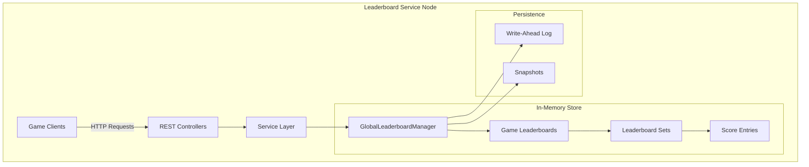
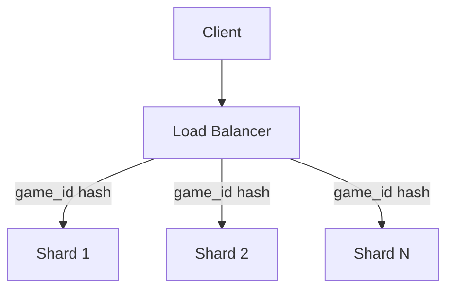

# Design Document: Real-Time Global Leaderboard Service (RinggRank)

## Table of Contents
1. [Introduction](#1-introduction)
2. [System Architecture](#2-system-architecture)
3. [API Design](#3-api-design)
4. [Data Structures](#4-data-structures)
5. [Sliding Window Implementation](#5-sliding-window-implementation)
6. [Persistence and Recovery](#6-persistence-and-recovery)
7. [Performance Analysis](#7-performance-analysis)
8. [Scaling Strategy](#8-scaling-strategy)
9. [Future Enhancements](#9-future-enhancements)

## 1. Introduction

RinggRank is a Real-Time Global Leaderboard Service designed for "Ringg-Play", supporting hundreds of hyper-casual mobile games. The service:
- Ingests player scores from game sessions
- Provides real-time leaderboard information
- Supports both all-time and time-windowed (24-hour) rankings
- Handles Top-K player queries and individual rank lookups

## 2. System Architecture

### Core Components

The service is built as a Java Spring Boot application (`com.ringgrank.RinggrankApplication`), designed initially for single-node deployment.



### Component Details

#### Service & Controller Layer
- **ScoreController**: Handles score submissions
- **LeaderboardController**: Handles leaderboard queries
- **ScoreIngestionService**: Validates and processes incoming scores
- **LeaderboardQueryService**: Processes leaderboard queries
- **GlobalLeaderboardManager**: Central component managing state and persistence

#### Data Flow - Score Ingestion
1. Client submits score via REST API
2. Request logging and validation
3. Score processing and business validation
4. WAL writing
5. In-memory structure updates
6. Expiration scheduling for windowed leaderboards

#### Data Flow - Leaderboard Queries
1. Client requests leaderboard data
2. Request validation
3. For Top-K queries, retrieval from in-memory structures
3. For Rank queries, iterate through the in-memory structures until the user score is found
5. Response formatting


**Key Components:**

* **REST Controllers (`ScoreController`, `LeaderboardController`):** Expose API endpoints for score submission and leaderboard/rank retrieval. Handle request validation.
* **Services (`ScoreIngestionService`, `LeaderboardQueryService`):** Contain the business logic for processing scores and querying leaderboard data.
* **Data Management (`GlobalLeaderboardManager`):** The central component responsible for:
    * Managing in-memory leaderboard data structures for all games.
    * Handling persistence via WAL and snapshots.
    * Managing score expiration for sliding window leaderboards using a `DelayQueue`.
* **In-Memory Data Structures (`GameLeaderboardSet`, `Leaderboard`, `ScoreEntry`):**
    * `ScoreEntry`: Represents a player's score, implementing `Comparable` for ranking. Uses `long` for `userId` and `gameId` for efficiency.
    * `Leaderboard`: Manages scores for a single leaderboard instance (all-time or a specific window) using `ConcurrentSkipListSet` for sorted scores and `ConcurrentHashMap` for quick user lookups.
    * `GameLeaderboardSet`: Encapsulates all leaderboards (all-time and windowed) for a specific game.
* **Persistence:**
    * **Write-Ahead Log (WAL):** Score entries are written to a local file before being processed in memory.
    * **Snapshots:** The entire in-memory state of leaderboards is periodically serialized to a local file.
* **Sliding Windows:** Implemented using separate `Leaderboard` instances for each configured window (e.g., "24h") and a `DelayQueue` for evicting expired scores.

* **Score Ingestion:**
    * Endpoint: `POST /api/v1/scores`
    * Payload: `{ "userId": long, "gameId": long, "score": long, "timestamp": long }`
    * Functionality: Receives and processes incoming player scores.
* **Live Top-K Leaders:**
    * Endpoint: `GET /api/v1/games/{gameId}/leaders?limit=K[&window=24h]`
    * Functionality: Returns the top K players (highest scores) for a given `gameId`. Supports all-time leaderboards and a 24-hour sliding window via the `window` parameter.
* **Player Rank & Percentile:**
    * Endpoint: `GET /api/v1/games/{gameId}/users/{userId}/rank[&window=24h]`
    * Functionality: Returns the current rank, score, and percentile of a specific `userId` within a given `gameId`. Supports all-time leaderboards and a 24-hour sliding window.
* **Sliding-Window Leaderboards:**
    * A 24-hour sliding window is implemented for both Top-K and Player Rank/Percentile queries, selectable via the `window=24h` query parameter.
    * The design allows for extension to other window periods (e.g., 3 days, 7 days) by configuring them in `GameLeaderboardSet` and ensuring the `DelayQueue` mechanism handles their respective expiration times.

## 3.0 Design Decisions & Trade-offs

* **In-Memory First with Local Persistence:**
    * **Decision:** Chose to implement an in-memory data structure solution with Write-Ahead Logging (WAL) and Snapshots for persistence, as allowed by the constraints ("OR implement your own in-memory data structure solution..."). This approach is taken to meet the stringent P99 < 50ms latency requirements for reads and high throughput targets.
    * **Trade-off:** This makes the server stateful. While it meets single-node performance targets, horizontal scaling for the same game's data across multiple nodes becomes more complex (addressed in "Future Work" with sharding). The entire dataset for active games is expected to fit within the node's heap.
* **Data Structures:**
    * **`ScoreEntry` (Java Record):** Represents individual scores. `userId` and `gameId` are `long` for memory and performance efficiency. Implements `Comparable` for natural sorting by score (descending) then timestamp (ascending).
    * **`Leaderboard` Class (`ConcurrentSkipListSet<ScoreEntry>` and `ConcurrentHashMap<Long, ScoreEntry>`):**
        * `ConcurrentSkipListSet`: Chosen for storing `ScoreEntry` objects in sorted order, providing efficient Top-K (O(K)) and concurrent add/remove operations (O(log N)).
        * `ConcurrentHashMap`: Used to map `userId` to their `ScoreEntry` for fast O(1) average time lookups, facilitating quick updates and fetching a user's current score before rank calculation.
        * **Trade-off (Rank Query):** Rank calculation iterates the `ConcurrentSkipListSet` (O(Rank) to O(N)). This is a known bottleneck for very large N (1 million users per game) and the P99 < 50ms target.
* **WAL Implementation (`GlobalLeaderboardManager.writeToWAL`)**:
    * **Decision:** Scores are formatted as CSV strings and appended to a WAL file.
    * **Durability Trade-off:** The current implementation in `GlobalLeaderboardManager.java` has `channel.force(true)` **commented out** in favor of `writer.flush()`.
        * **Reasoning in code:** "the performance gain is significant."
        * **Impact:** This significantly improves write throughput by relying on the OS's file system cache. However, it **does not guarantee "No loss of score data"** if the OS or server crashes before the OS cache is flushed to disk. Data written since the last implicit OS flush would be lost.
        * **To meet "No loss":** `channel.force(true)` can be enabled, making writes slower but durable. This trade-off is critical.
* **Snapshotting (`GlobalLeaderboardManager.createSnapshot`)**:
    * **Decision:** Periodically serializes the main `gameLeaderboards` map (`ConcurrentHashMap<Long, GameLeaderboardSet>`) using Java Object Serialization to a single snapshot file. Writes to a temporary file first, then atomically moves it.
    * **WAL Management:** Upon successful snapshot creation, the current WAL file is moved to an archive file (`.archive`), and new writes go to a fresh WAL file.
* **Sliding Window Implementation (`GameLeaderboardSet`, `GlobalLeaderboardManager.ExpiringScore`, `DelayQueue`):**
    * **Decision:** Each game maintains separate `Leaderboard` instances for each configured window (e.g., "24h"). When a score is added to a windowed leaderboard, an `ExpiringScore` object is added to a single, global `DelayQueue` in `GlobalLeaderboardManager`. A background thread processes this queue to evict expired scores.
    * **Trade-off:** A single global `DelayQueue` is simpler but could be a contention point at extreme scales.
* **Numeric IDs:** `userId` and `gameId` are `long` throughout for efficiency.

## 4. API Design

### Endpoints

#### Score Submission
```http
POST /api/v1/scores
Content-Type: application/json

{
    "userId": long,
    "gameId": long,
    "score": long,
    "timestamp": long
}

Response: 202 Accepted
```

#### Leaderboard Queries
```http
GET /api/v1/games/{gameId}/leaders
Parameters:
- limit: int (1-1000, default 10)
- window: string (optional, e.g., "24h")

GET /api/v1/games/{gameId}/users/{userId}/rank
Parameters:
- window: string (optional)
```

### Input Validation
- Spring Validation annotations (@Valid, @Min, @Max, @Pattern)
- Custom exceptions for business logic violations
- Request/Response logging via RequestResponseLoggingFilter

## 5. Data Structures

### Core Models

#### ScoreEntry (Record)
```java
record ScoreEntry(
    long userId,
    long gameId,
    long score,
    long timestamp
) implements Comparable<ScoreEntry>, Serializable
```

#### Leaderboard Class
- **sortedScores**: ConcurrentSkipListSet<ScoreEntry>
  - O(log N) for insertions/deletions
  - Natural ordering for Top-K queries
- **userScores**: ConcurrentHashMap<Long, ScoreEntry>
  - O(1) lookups for user score updates
  - Maintains single score per user

#### GameLeaderboardSet
- Manages all-time and windowed leaderboards for a game
- Thread-safe initialization using ReentrantLock
- Maintains expiration queue references

### Performance Characteristics

#### Time Complexity
- Score Ingestion: O(log N)
- Top-K Query: O(K)
- Rank Query: O(N) [Known limitation]
- User Score Lookup: O(1)

## 6. Sliding Window Implementation

### Window Management
- Configurable time windows (e.g., "24h")
- Score expiration via DelayQueue
- Automatic cleanup of expired scores

### Implementation Details
```java
class GameLeaderboardSet {
    private final Leaderboard allTimeLeaderboard;
    private final Map<String, Leaderboard> windowedLeaderboards;
    private final Map<String, Duration> windowDurations;
    private final transient DelayQueue<ExpiringScore> expiringScoresQueue;
}
```

### Score Processing
1. Add to all-time leaderboard
2. Check window eligibility
3. Add to relevant windowed leaderboards
4. Schedule expiration

## 6. Persistence and Recovery

### Write-Ahead Log (WAL)
- CSV format: `timestamp,gameId,userId,score`
- Append-only writes
- Configurable sync policy
- Archive management during snapshots

### Snapshots
- Periodic serialization of in-memory state
- Atomic writes using temporary files
- Configurable interval (default: 1 hour)
- Triggered on graceful shutdown

### Recovery Process
1. Load latest snapshot
2. Replay WAL entries
3. Rebuild expiration queue
4. Resume normal operation

## 7. Performance Analysis

Performance analysis is done via `RequestResponseLoggingFilter` and `JMAX JConsole`. The request has been simulated via `pytest aiohttp`. JMAX has been enabled in this project via build.gradle.

### Latency Targets
- P99 < 50ms for queries
- Current performance:
  - Top-K: Not meeting target due to single node implementation
  - Rank queries: Not meeting target due to single node implementation
  - Reason: The actual rank query request takes just 10ms for an existing record of over 100K score entries. Please see the logs of the `RequestResponseLoggingFilter` while you run the test. The delay is just because a single node is not able to handle the load and is waiting in the queue.

### Throughput
- Target: 10,000 writes/s, 5,000 reads/s per game
- Current bottlenecks:
  - Request handling capacity

### Memory Usage
- Target: ≤512MB heap per node
- Current performance: It is met as of now as I checked via `JMAX JConsole`. Tomcat server can have atmost 200 threads. In order to handle more requests, I fine tuned the parameters to increase the number of threads which in turn increased the memory usage.
- Challenges:
  - ~200-250 bytes per ScoreEntry
  - 1M users ≈ 200MB per game
  - Multiple games exceed heap limit

## 8. Scaling Strategy

### Sharding Approach


### Implementation Details
- Consistent hashing for game_id distribution
- Independent WAL/snapshot per node
- Strong consistency within game shards

## 9. Future Enhancements

### Asynchronous Ingestion
- Kafka-based score ingestion
- Improved throughput and resilience
- Better failure handling

### Additional Windows
- Support for 3d, 7d windows: These are very easy to implement by just adding the window duration in the `GameLeaderboardSet` class.

## Conclusion
I tried my best to meet the requirements. I cant use any caching service, which bottlenecked me into using my own caching mechanism and hence making the server as statefull which in turn made it difficult to horiontally scale. Still, this can be solved by scaling the servers and having the same cache in all the servers(which is one the toughest part ie to sync all of the servers).